# 视听语言自学

> 概念、作用、意义之间没有严格的区分。以下以次做出的区别全是方便行事而已。概念的诞生本身就是为了表达一个意义，意义的落实也是作用所在。
> 对一个知识的概念应当求高度完整的概括。意义是在作用之上总结，而作用应力求完整。

## 影像构成

影像的构成细分为7个部分，主体、陪体、前景、背景、影调、线条、色彩。

### 主体与主体的突出

从概念上来说，我们认为主体是一个画面内容的主要体现，同时主体也是这个画面的结构中心，但是在我们对它进行约束的时候，我们会说主体并不需要出现在画面的中心位置，它可以出现在画面的任何一个地方，但是**重点就是要强调要突出。**

- 虚实法
- 线引导法
- 黄金分割点(包括九宫格交点)
- 明暗法
- 线条对比法

### 背景

> 概念：所谓背景是指的处在画面主体背后的景物，我们称之为背景，那么背景其实也被称之为后景，因为它对应的叫前景，处在画面主体身后的这些景物，我们就称之为背景。
>
>> 在画面的构成中，画面的培体和前景都是可以增加或删除的部分。但是画面的主体和背景都是画面必须存在的部分

#### 为主体服务

能够让背景充分的为主体服务，这是我们看到作为背景其信息功能与主体之间关系的一个有效搭配。

- 交代主体所在的环境
- 交代主体的身份特征
- 表达主体的情绪或者是情境

> 背景选择tips
>
>> 1. 选择那些与主体有着紧密关系的环境特征，对主体人物形象塑造
>> 2. 背景本身不能够干扰到主体的形象
>> 3. 让整个画面的层次变得更加丰富

#### 背景的形式美

- 形式与意境
- 空间的纵深感

### 陪体

> 对于画面内容的一个有意思的补充，是画面中除了主体外另一个重要的对象。

#### 内容上的作用

- 帮助主体解释主题，实现单镜头叙事(与主体之间有紧密的关联或者呼应)

> 这种主配之间打关系有着严格的对应（主配之间的关系直接影响了画面所要表达的内容）

- 纯粹气氛渲染，带入到一个情景中

#### 画面上的作用

- 实现画面的一种均衡，或者产生画面的空间感，对象感

> 这里关于内容画面的区分只是为了知识梳理的方便，实际上内容与画面的形式之间互相交融，形式美本身也是内容。
> 这与主体和陪体的区分一样，主体和陪体看似区分实际上在表达一个主题时，二者是不可分割的整体。只有二者的联合才能表达应有的意义来。甚至整个画面也是一个整体，在分与合之间是一条通往体验的完整通路。
> 我们的意向在此间流动，真实的画面永远都是一个整体，但是只有完成一次分合，我们的意向才有在画面与整体之间流动的道路。意义也在此间诞生。

### 前景

> 前景是镜头前面最靠近镜头的那些景物，也就是说是冲击在画面靠近镜头的那些景物。
> 没有一个约束它所存在的位置，也没有约束它的形态。
>> 它可以出现在4边，也可以出现在4角，它既可以是虚像，也可以是虚像，它既可以是一个框架结构，也可以弥漫在画面的所有的位置。
>
> **约束是它的功能。**

#### 视觉冲击

近大远小的视觉夸张

#### 框架装饰

- 装饰画面
- 对画面重新构图

#### 视觉引导

#### 信息补充

对内容的有效补充

#### 遮挡作用

- 遮挡干扰次要信息
- 简化构图
- 压低画面层次，调整影调

### 色调

> 是画面的色彩基调，而不是某一个色块

#### 对情绪的隐喻引导

- 在潜移默化中影响观众的情绪
- 是主题表达重要推手
  
> 当色彩与画面内容结合之后就会带来情绪上的引导
>>（重要的是内容与彩色结合，单独的颜色没有特别意义）
>
> 没有颜色的色调成为消色（黑白）
> 色调的饱和度带来的对比

#### 画面空间的有效调度

- 色调与色块的对比

> 在统一的色调中出现一个特别的颜色色块时可以表很多内容

- 冷暖色调之间的协调
  
### 线条

> 画面钩虫中形式的重要体现，对形式美的表达
>
> - 线条的形式并不重要重要的时**从现实中抽离出线条感**
>
> - 对画面表达时要有线条的谋略
>
>> 线条可以是直线曲线划分也可以用字母划分但这并不重要

#### 辐射形线条

- 聚焦
- 发散
  
> 对画面内容引导

#### 曲线

- 添加画面的灵动柔美
- 增加空间感
  
#### 斜线（对角线）

- 画面动感
- 增加画面的空间

#### 三角线构图

- 增加画面的稳定感
- 增加画面的纵深
  
> 是画面稳定性和灵动性很好结合

#### 环形构图（O形）

- 画面集中和发散
  
#### 线条带来的透视

- 一字形构图形成的纵深与画面的灭点

>一般将画面的灭点放在黄金分割点处形成画面直线与曲线的结合
>>
>
> 色调线条直线曲线纵深结合
>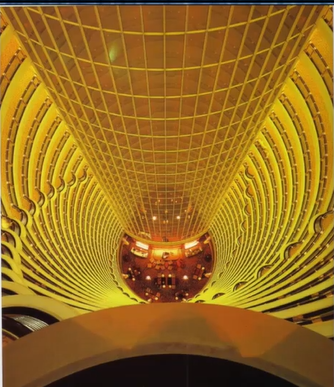

## 影像的角度选择

### 景别（角度中的距离关系）

> 景别规范了镜头的内容意义

#### 大远景与远景——环境镜头

- **大远景**

> - 情绪渲染，营造氛围
> - 奠定视频的整体基调
> - 人物高度小于等于画面高度的四分之一
> - 氛围镜头组
>
>> 当整个视频的镜头数量不多（时长不多），营造氛围的镜头不用太多.长篇视频的氛围营造需要一组镜头
>>> 氛围渲染镜头的模板：大环境到最小环境到点睛之笔（最后也可以回到大环境）

- **远景**

> - 人物高度占据画面高度一半
> - 远景可以对画面内容承上启下
> 例如画面中全景中有一人一物，那么接下来就分别是人与物的近景
>
>> <a id="jump1"> 远景镜头组逻辑 </a>
>>>为什么镜头有这样的逻辑☞ [镜头的未来性](#未来性)
>>
>> 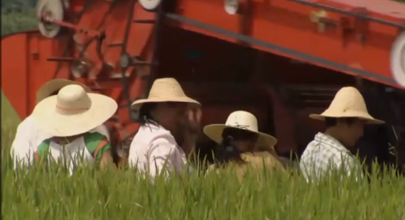
>> 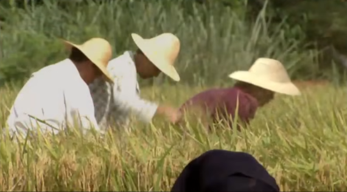
>> 
>> 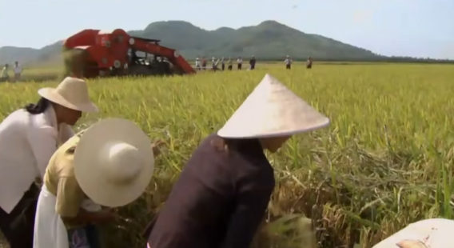
>> 
>> 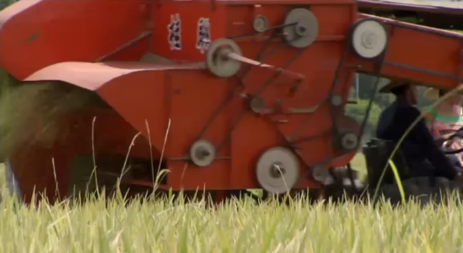

- **注意** ：大远景与远景都是结构性的镜头所以在拍摄中应当 ***严格控制其数量***，因为它不是主要的内容阐述方式。但是大远景和远景的形式美感氛围感很充足所以在一些宣传片中占据比较多，但是由于内容不足所以比较依赖旁白解说填充信息空白。

### 大全景和全景中景——关系镜头

- **大全景**

> - 大全景已经开始故事叙事
> - 给了环境更多的表现空间，交代全面的空间关系。
> - 人占整个画面高度的3/4

- **全景**

> - 与整个画面高度是1:1的满幅状态
> - 交代形体关系
> - 全景并非万能 对于具体的指向性不强（例如人物特点特征）

- **中景**
  
> - 画面在人物膝盖之上中景（腰以上为中近景）
> - 人物关系叙述
>
>> 关系叙事就是在一个镜头内部来形成人与人之间关系的一个对比，或者是一个关系的扭结，进而能够。形成更为丰富的信息的传达。借助镜头内部的逻辑来表达镜头叙述的客观性。

### 近景和特写——细节

- **近景**
  
> - 躯干三分之一强，头部三分之一弱
>
>> 来自对人体比例的审美——黄金分割线
>
> - 人物神情的捕捉（已经是细节镜头）

- **特写**

> - 具有明确的目的性
> - 具有丰富的信息
> - 国外有一种标准就是让特写占据整部片子的一半

### 角度的方向关系

> 角度的选择具有很强的

- **正面**
  
> - 利于表现画面的形状感
>
>> 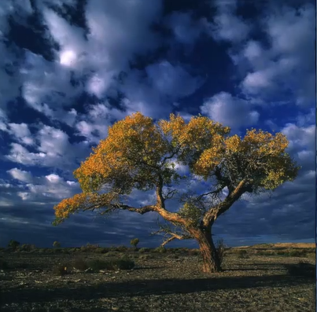
>>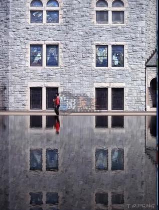
>> 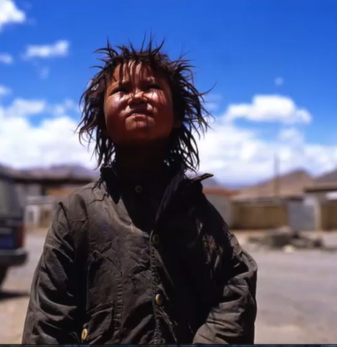
>
> - 被摄对象与镜头间的直接交流
> - 不利于表现画面的纵深感或者是立体感
> ***角度的选择本身是具有很强的内容关联的***

- **斜侧**

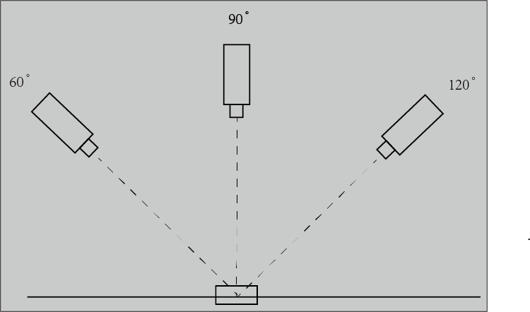

> - 90°到180°之间
> - 画面的纵深感，加强景深
>
>> - 30°斜侧——更强的正面形状
>>
>> 一般用于采访的（七分脸)方向感和面部主要信息都能体现
>>> 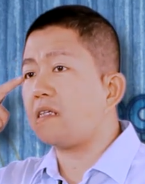
>>>
>> - 60°斜侧——更强的方向性,纵深感
>>
>>>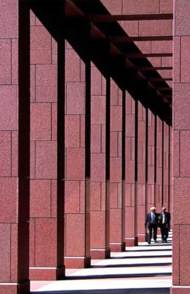
>>
>> - 45°对角斜侧
>>
>> 利于去拓展整个画面的空间感。
>>>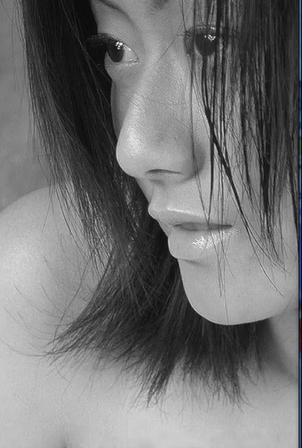

- **侧面**

> - 正侧
>
>> - 利于表现方向感
>> - 对脸部轮廓的勾勒产生了交流感
>> - 常用于剪影/
>>
>>> 由于正侧对脸部另一半脸部的完全的遮蔽，导致两个对象**有严重的对峙感**，这使得正侧角度在实际中运用很少
>>> 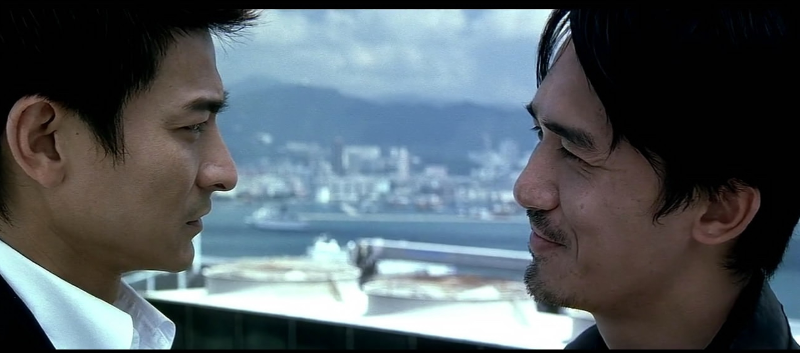
>>
>> - 最强烈的速度感
>>
>>>（同时也缺少了运动的**立体姿态感**）
>>> 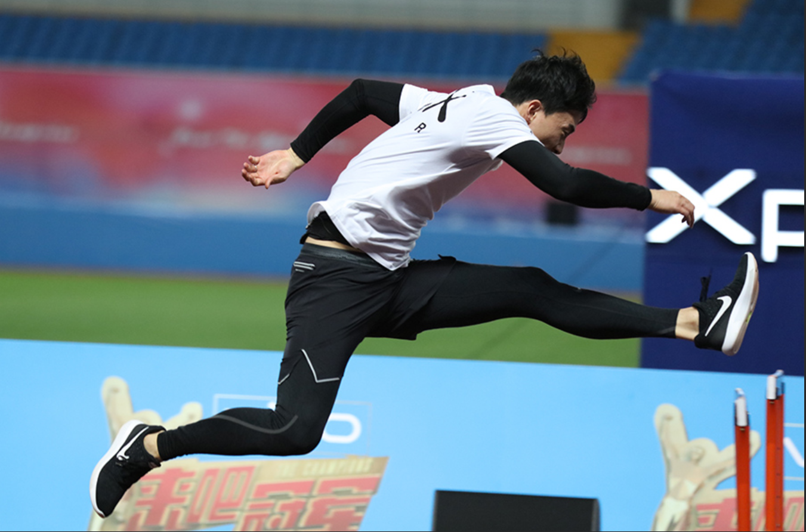
>
> - 30°斜侧
>
>> - 速度与运动姿态的共存
>>
>>> 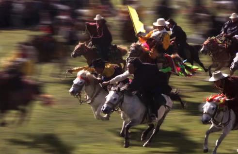
>>
> - 60°斜侧
>
>> - 与对象的勾连感（方向感）
>>
>>> 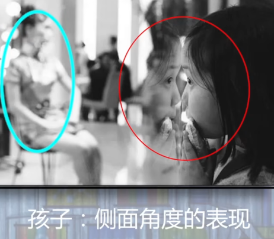

- **背面**

> - 借实写意（视觉联想带来一些韵味）
>
>>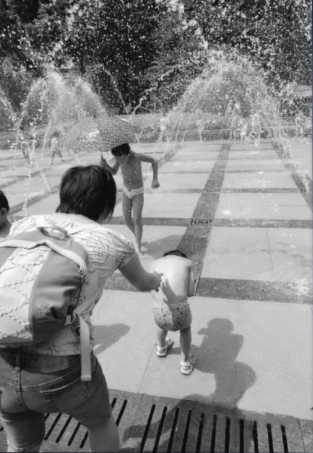

- **背侧（反侧）**
>
>> - 牵引作用
>>
>> 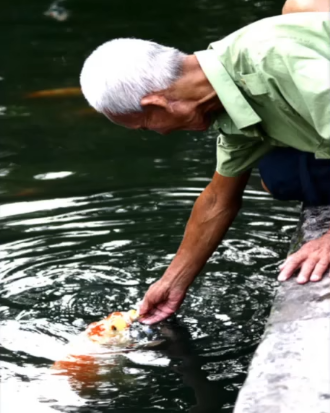
>>> 用于表现对象面对的对象，用于牵引向另一个对象(时常用于摇镜，引导对象入画)
>>
>> - 出其不意感
>> 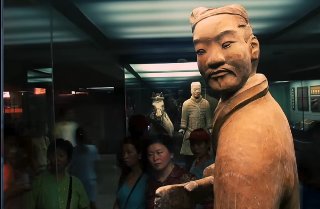

### 高度关系

> 机位与被摄对象之间垂直关系
>
- 情绪营造
>
> - 仰视
>
>> 表达崇敬
>> 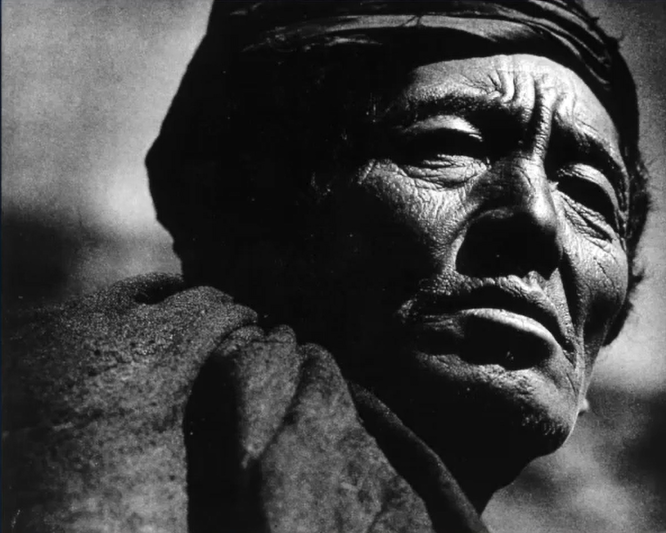
>
> - 平视
>
>> 自然，客观
>> 
>
> - 俯视
>
>> 矮化
>>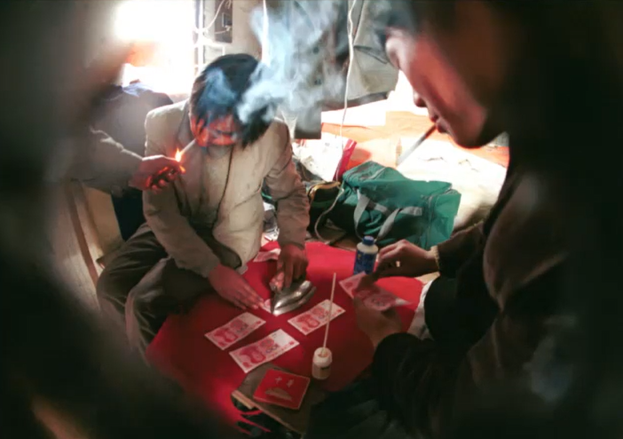
>
- 层次搭建

>
>

- 视觉冲击
>

### 角度的基本功能

- 原有场景空间的透视关系

>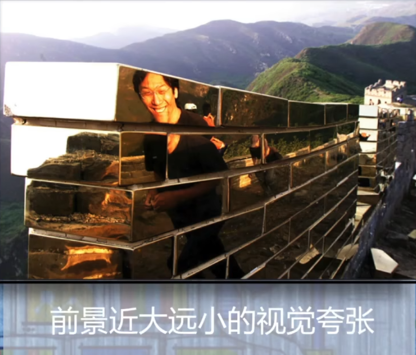

- 体现人物位置关系及叙事关系的变化
  
>

- 有效地表达人物形象

> 

- 一种主观的及视觉形式的处理

> 

- 决定影像视觉形式的风格

> 画面光线的控制
>> 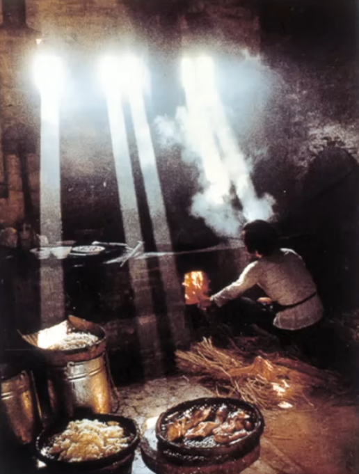

## 影像的镜头形态

### 镜头的概念

#### 属性

- 过程性

> 一个镜头必须表达对象的运动过程而不是照片式的状态表达

- <a id="未来性"> 不可知性（未来性）</a>

> 镜头记录的过程需要保持一定的发展，使得镜头能与下一个镜头有所勾连，而下一个镜头往往是在未来的这就使得镜头需要向未来取材，保持内容具有一定的不可知性，能够进一步开启下一个镜头解开这个镜头无法表达的内容。
>> 参考全景镜头组之间的调度。一个全景的对象往往不具备细节，但是全景对场景整体的视觉表达，内在就给对象由这种场景引起的变化留下了可以继续表达的空间。这就规定了☞[全景景镜头组逻辑顺序](#jump1)

- 框架

> 一个镜头一定是在一个框架内的，这就必须进行场面的调度
>> 不管是人员的调度还是镜头的调度保持需要表达的内容始终在框架内
>>> 同时对镜头还是对象的调动有着不同的作用具体参考固定镜头与运动镜头

### 固定镜头

#### 固定镜头的概念

##### 三不动镜头

- 机位不动

> 摆脱了机位移动的可能性

- 光轴不动

> 摆脱了摇镜头的形态

- 焦距不动

> 摆脱了机位推拉的运动形态

##### 相对静止

> 固定镜头与其拍摄的主要内容之间的关系要求相对静止
>> 注意这里是主要内容，而不是对象或者人。人与镜头之间的相对静止也会导致运动镜头例如：**跟镜头**
> 相对静止的镜头也是主要对画面内容信息有利的传达

#### 客观表达

- 实际上是指的固定镜头在拍摄的时候要尽可能的保持稳定

> 这种客观表达是相对与晃动镜头而言的，是对画面内容的专注表达没有镜头本身其他的其他影响——例如镜头的晃动会带来镜头本身的信息传达从而造成对原本需要呈现画面内容额外的信息

#### 构图精确

> 构图精确的重点在于运用构图语言对内容进行准确的信息传达
>> 这种有效的构图安排涉及镜头的景别，主体在画面中的位置需要完整的镜头语言支撑，才能让构图精准。这种精确需要大量的拉片思考。这次不过多介绍。
>>> 参考课中的拉片分析给出构图精准的几个要素
>>>
>>> - 景别
>>> - 主体在画面中的位置
>>>
>>>> 
>>>> 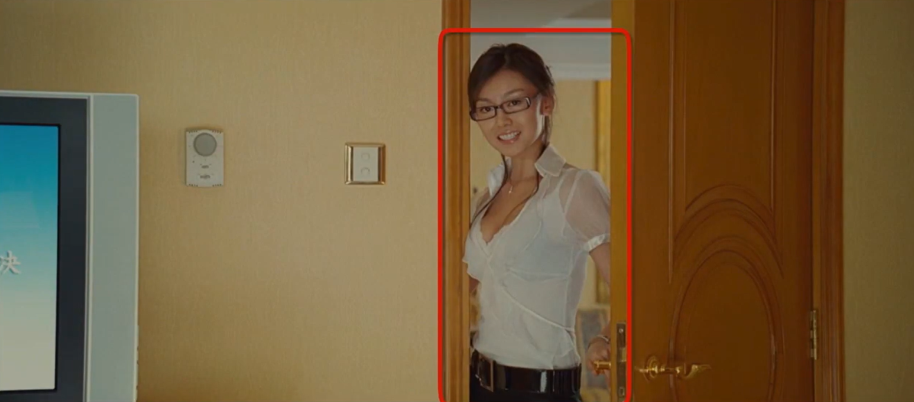
>>>> 
>>>
>>> - 镜头数量与出现顺序
>>>
>>>> 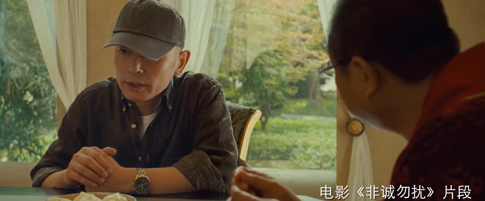
>>>> 
>>>> 
>>>> 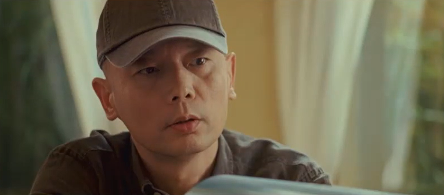

#### 固定镜头的光线营造

> 机位决定光位
>> 机位不定，其实是光位不定的，机位与光源相对就是逆光，相对侧面就是就是测光

##### 光线营造的目的

> - 隐藏光源不要穿帮
>
>> 固定镜头更有利于光线的营造，更有利于去进行一个良好的光线的搭置
>
> - 维护画面的真实感
>
>> 保证时空的连贯性（包括色调，光源位置）
>>>
>>>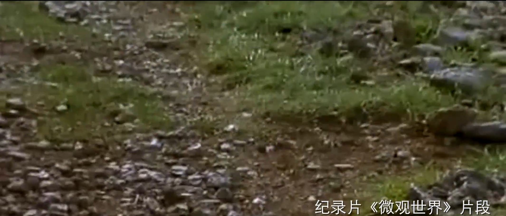
>>
> - 营造被摄对象的质感
>
> - 营造纵深感

##### 三点布光法

- 主光
- 辅光
- 轮廓光
- 背景光(空间纵深)
  
> 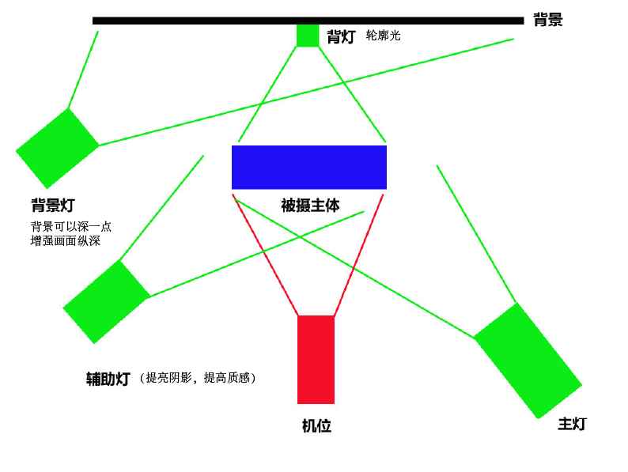
>
>> 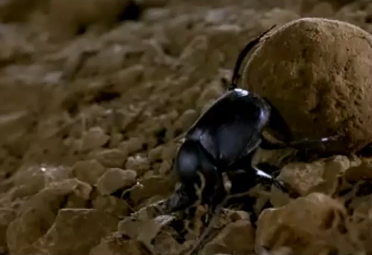
>> 

#### 固定镜头的动作连贯

> 固定镜头的动作连贯是通过分镜头的方式来实现这就是分镜组
> 他的镜头的表现力很大程度上并不来源于单个镜头的表述，而来源于镜头与镜头之间的衔接。

##### 拍摄要求

- 必须改变机位角度或景别中的任何两个
- 成组拍摄
  
> 每拍一个镜头都要去想一想它的上一个镜头是什么，它的下一个镜头是什么，它们为什么可以构成这样一个组

##### 剪辑法

> - 1/2剪辑法
>
>> 特点在于它实际上让动作的持续的时间与原来的动作时间是一致的，没有改变动作的持续时间
>> 一个动作变成两个之后就变成了两拍，但却改变了动作节奏
>
>
> - 2/3剪辑法
>
>> 第一个动作占整个动作的2/3。第二个动作其实也占整个动作的2/3
>> 中间重复一秒重复产生强调它改变动作时间，以形成强调的目的
>
>
> - 1/3剪辑法
>
>> 第一个动作我们其实手指举到1/3处，但是第二个动作并不是从这开始，而是从2/3处举过头顶，于是我们会发现1/3减去法，其实中间这个部分是没有的  
>> 节省了动作的时间，那么显然加快了动作的节奏，同时提高了片子单位时间的信息量  
>> 大量的减少了细节表达，从而形成了一种特别干练的动作表达的这样
>

#### 景深控制

> 画面从前到后的整个空间的运用

##### 小景深控制

> 小清新风格
>> 在于景深变化带来的焦点转移形成画面内容信息的主次变化
>>> 
>>> 

##### 大景深控制

> - 特点在于它要形成画面的**前中后的层次变化**
> - 其控制靠的是画面的层次的相互之间关系的有效调配
>
>> 
> 观众其实可以在画面的诸个层次里面自由选择他要关注的重点。因此大景深的景深控制带来了一种更为客观的表达，所以在纪录片里面使用大景深的景深控制会比较多。

#### 节奏控制

- 剪辑节奏

> 固定镜头的特点在于它的逻辑并不来自于镜头的内部，而来自于镜头的外部，也就是通过剪辑将镜头组的内容有效的组织在一起，这样才能够形成一个整体  
>> 当内容的内部节奏足够张扬的时候，外部节奏不添乱，当内容节奏本身不足的时候，外部节奏要打气，这就形成我们说一个固定镜头的节奏控制，其实来自于内部的内容节奏和外部的剪辑节奏的有效配合，将外部的剪辑节奏与内容节奏有效的进行组织的时候，才能够让整个片子张弛有道松紧适度  
详细参考☞[节奏把控](#节奏)

#### 固定镜头适用的内容

 固定镜头本身是不动的机位，是在一个框架内部表现内容的这就产生了几种镜头本身的特性
>
> - 驻足详观的视觉体验
>
>> 对画面内容本身的表现
>>
>> - 有利于画面本身情绪的营造
>>
>>> 包括回忆，以及安静的环境
>>
>> - 善于表现人物
>> - 动作表现
>>
>>> 通过分镜表现动作的各个方面——包括微观的细节，中观的关系以及宏观的环境。
>>> 通过动作组接将不可能的动作变成可能

#### 固定镜头拍摄注意事项

- 表现框架内动态的内容（镜头不变画面变）
- 注意画面的纵深（固定镜头本身不能展现丰富的空间层次）
- 善于捕捉优美的构图（由于框架固定，要在构图上有更多的构图审美，外部的形式美感）
- 考虑镜头内容逻辑组接镜头组

>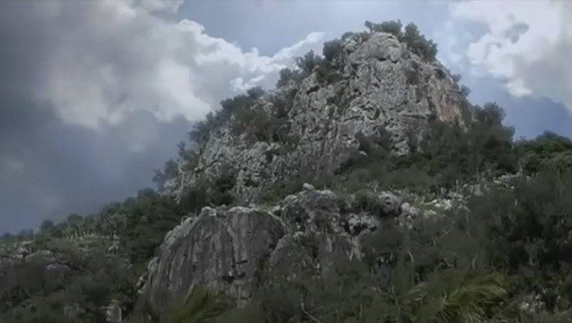
>
>
>
>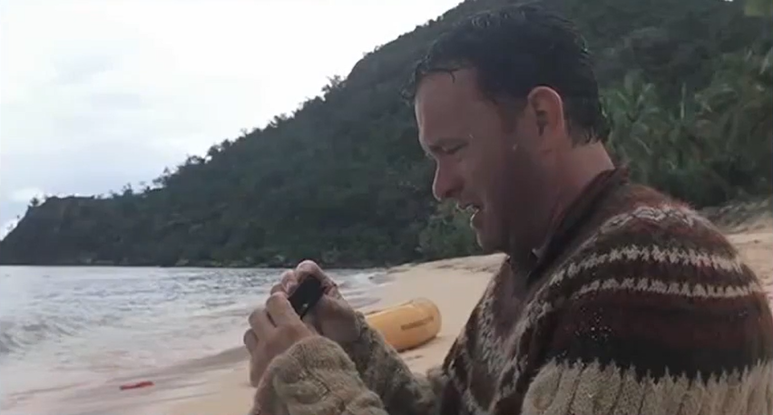
>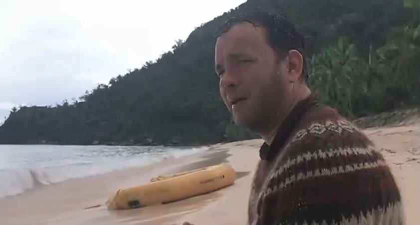
>

### 运动镜头

#### 概念分类

任何运动镜头的拍摄其实是由三个部分构成的。
 以推镜头为例，作为这个运动镜头的起幅，然后从静态开始慢慢向前推，这就构成了推动的运动效果。当我推到我的镜头的呃落幅的时候，我要再静止一段时间，这个就造成我们镜头的落浮。
 **所以实际上任何运动镜头都包括开始的静止，叫做起幅。**

> - **推与拉**
> 推还是拉更强调镜头的落。
>
>> 大范围到小范围,强调细节，小到大强调范围（镜头组）
>>
>> - 变焦推拉，不能够符合人眼的视觉经验
>> - 机位移动推拉，机位推拉更自然
>>
>>> - 在新闻中经常使用，但是一些明显的细节不需要推，否则会影响客观表达（沉浸式表达）
>>> - 拉镜头会进入更多信息，会带来悬念感
>>> - 拉镜头一点点拉开会有一种退出感，有一种谢幕感觉，相反推镜头就有一种进入感，一种开始感
> 
>
> - 摇
>
>> - 提供一种浏览的感觉(清明上河图)
>> 每时每刻都在提供信息，内容次地展开
>> - 创造一种起幅与落幅之间的视觉逻辑的连接
>>
>> - **甩**--特殊的摇（快速大范围内的空间与时间转移）
>
>
> - 移
>
>> 移镜头本身实际上代表着所有的运动形态的一个整合,要体现各种运动形式的有效的结合，并且**创造镜头的视觉张力和空间表现力**，这才能够体现出一镜头的表现力来。
>>
>> - **跟** 主观镜头,沉浸式体验
>>
>> - **升**
>>
>>>拉镜头加摇镜头的一个组合  
>>>摇镜头次第展开信息量+从局部来到了整体
>>
>> - **降**
>>
>>> 推镜头和摇镜头的组合
>>>整体到局部+信息次第减少

**tips:** 寻找一个节奏进行运镜练习，编排各种运镜

#### 运动镜头的造型功能

> - **空间调度**
>
>> 不是为了去表现空间本身，而是要借助对于空间的调度或者对于空间的运用来***实现镜头的表现力*** ，运动镜头本身并不是用来提供信息量的镜头。所以在他除了提供情感之外，他更重要的一个方面在于***提供视觉效果***
>>
>> - 空间的丰富性
>> - 综合运动的运镜效果（丰富的镜头样式）
>> - 有线索的有效贯穿
>>
>>
> - **情感表达**
>
>> 相比固定镜头信息表达更加拖沓，但能通过时间的积累形成情绪的积累  
>> 所以每次运用长运动镜头的时候需要塑造某种情绪积累
>
>
> - **关系构建**
>
>> 固定镜头的*逻辑构建*是通过外部剪辑来实现的，所以它的逻辑其实是剪出来的而运动镜头的逻辑是拍出来的  
>> 镜头的运动可以将起伏与落浮的事物进行镜头的有效连接，也就是通过镜头的调度来建立一种关系
>>
>> - 通过线索人物来提供信息量
>>
>>> 关系的构建信息量并不在于线索人物本身，而在于与线索人物一同经历的那些信息量。这种关系构建通常使用**跟镜头**。
>>>
>>> - 跟腚镜头  
>>> 跟镜头的重点在于跟出了信息量没有，如果我们的跟镜头本身并没有带来信息量，那么这种跟镜头就失去了意义
>>> - 线索/线索人物的更迭  
>>> 一个复杂的运动镜头的空间调度和人物关系的构建过程中，会不断的更换我们的线索人物,带来更为丰富的信息量  
>>> ☞[赎罪经典的一个跟的长镜头]中整个这个敦刻尔克的这样的一个场景有极其丰富的表现，同时能够去理解这三个线索人物的人物性格特征。
>>
>> - 快速塑造人物特征和人物关系
>>
>>> 在一个较短的时间内对复杂的人物关系或者是对复杂的人物形象进行一个更为全面的了解。  
>>> 包括**人物的特点**，他们的**身份的特征**，以及他们相**互之间的关系**。☞[《风声》传报文片段]中通过报文传递作为线索的一个长跟镜头，在极端时间内交代剧中主要人物的关系他们的特征和工作环境。

[赎罪经典的一个跟的长镜头]: https://www.bilibili.com/video/BV1i7411t7rt/?spm_id_from=333.337.search-card.all.click&vd_source=9ae5fb05c771775a6b5923ba1c682cf7

[《风声》传报文片段]: https://www.bilibili.com/video/BV16t411n7Zu/?spm_id_from=333.337.search-card.all.click&vd_source=9ae5fb05c771775a6b5923ba1c682cf7

## 后期剪辑

### 剪辑的基本层级

> **单镜头剪辑**  
> 基本技巧 一个镜头与另外一个镜头衔（这种剪辑的方式与具体是什么内容实际上是没有关系的）
>
> - 动静衔接
>
>> - 静接静
>>
>>> 固定镜头与固定镜头相接,运动镜头在剪辑点在前一镜头的落幅之后后个镜头的起幅之前
>>
>> - 动接动
>>
>>> 就是剪辑点在起一个运动镜头的起幅之后后一个运动镜头的落幅之前
>
> - 景别衔接  
> 上下镜头间一定要有景别变化。
>
>> - 相隔景别相接
>>
>>> 同景别相接是会跳,相隔景别相接其实在规范我们使用镜头的一些基本的要求。
>>
>> - 相邻景别相接
>>
>>> 需要三个以上的镜头构成镜头组才能衔接,(蒙太奇句子) 形成明显的逐步式节奏包括后退式、前进式
>>>
>>> - 后退式  
>>> 例如特写、近景、中景接全景的效果
>>>
>>>> 会形成一种次第退出的效果，我们称之为后退式的蒙太奇句子。这种节奏明显的后退句型使得我们能够产生与被摄主体之间的远离感
>>>
>>> - 前进式  
>>> 全景\中景\近景
>>>>
>>>>会形成一种次第进入的效果。这种节奏明显的句子使得我们能够产生与被摄主体之间的接近，突出主体的具体细节产生强调或惊讶的效果
>
> - 成组衔接  
> 考虑镜头成组的基本要求
>
>> 全面的去表现一个事物，往往需要把整个事物的镜头分成三类，也就是我们要把这个事物的镜头分为
>>
>> - **环境镜头**
>> - **关系镜头**
>> - **细节镜头**
>> 来进行有效的组织
>>
>>> 我们来进行镜头的拍摄的时候，往往强调的就是镜头要一组一组的拍，而不是一个一个的拍，因为任何单个镜头都不能够单独的完成一个叙事的任务，或者是一个信息表达的任务，它需要和其他镜头有效的组合在一起，才能够形成一个完整的信息的传达。
>

### 蒙太奇

#### 微观蒙太奇（镜头衔接）

> 微观蒙太奇控制的是镜头与镜头之间衔接的关系

- 动作剪辑点

> - 动作的开始
> - 动作的结束
> - 动作的出现或动作的消失
>
>> 出画入画
>
> - 动作的中间的停顿点或者是转折点
  
- 情绪剪辑点

> 会出现一个大面积的留白，留白的目的就是为了让情绪有一个宣泄的空间。

- 节奏剪辑点

> 节奏的重点并不是有规律性而是产生变化
>>> 这种节奏在一些广告宣传片中比较多参考解说片段☞[剪辑的节奏]

[剪辑的节奏]:https://www.bilibili.com/video/BV1BT4y1r7eu/?spm_id_from=333.999.0.0&vd_source=9ae5fb05c771775a6b5923ba1c682cf7

#### 中观蒙太奇（段落衔接）

> 段落与段落之间衔接的关系

##### 特效转场

> 黑场专场

##### 非特效转场（无技巧转场）

> 完全是通过镜头的拍摄构成了一种镜头的逻辑，进而完成场景与场景、事件与事件之间的转换。
> 无技巧转场的一个基本特征，就是无技巧转场的重点在于让观众忘记转场因素，不要发现转场的痕迹，**勾连场景之间的关系和内容**

- 出画入画转场

> 通过主人公走进画面或走出画面来形成场景与场景之间的有效转换

- 两极镜头转场

> - 特写转场
> - 空镜转场
>
>> 大多数的空镜都可以提供空镜转场逻辑的结构性镜头

- 遮挡转场(挡黑转场)
- 相似体转场
>
>利用上一个镜头与下一个镜头在某些动作或者是细节上的相似性来完成向下之间的转转接关系

- 承接转场

> 上一个镜头的动作或者是内容。构成了下一个动作或内容的一个结果的理由

- 声音转场

#### 宏观蒙太奇（叙事线索）

> 解决的是整个片子的谋篇布局。称宏观蒙太奇也为结构蒙太奇，因为它是服务于结构需要的蒙太奇策略。

##### 叙事蒙太奇（基础）

- 平行蒙太奇
  
> 讲完a这个人物之后，就开始讲B这种并列结构，其实就构成了我们所说的并列蒙太奇，也是平行蒙太奇。
>> 进行结构安排的时候，为了使结构变得丰富起来，通常我们的片子里面不止一个人物。

- 交叉蒙太奇

> 交叉蒙太奇同样需要有两条线索，但是这两条线索在片子的具体呈现上是要有交叉的，在某时某刻形成两条线索之间的结合

- 复现式蒙太奇

> 不是现实中的两条线索的穿插，而是现实与历史的穿插。也构成了一个叙事的结构安排

- 叫板式蒙太奇

> 叫板的意思就是形成了内容的呼应,形成了两个时空之间的一种有效的跳接，丰富了我们整个的叙事的内容。

##### 表意蒙太奇（提升，情绪）

- 隐喻蒙太奇，也称之为象征蒙太奇

> 借此物来比喻彼物，从而形成一种意义上的勾连，或者是一种意义上的外延，进而形成我的一种观点表达。
>> 小孩子朝气蓬勃的样子，然后我就拍的是一些绿草茵茵中的花朵，其实我就是想要通过这两个镜头的衔接来表现这个孩子像花儿一样。并不是真的想要表现花和孩子的信息，而是花和孩子之间的一种观点上的勾连。

- 对比蒙太奇

> 比方说杜甫的名句朱门酒肉臭，鹿有冻死骨，其实也就是将两个场景有效的并列在一起，形成他的观点对于当时腐败社会的有力的抨击。

- 积累蒙太奇

> 积累蒙太奇就是对于一个细节的反复出现，强调观众对于这一细节所产生的意义的一种理解。通过对细节的反复的这样的一种组织来形成一种情绪。
>这种情绪积累的经典判断☞[无间道天台举枪场景]

[无间道天台举枪场景]:https://www.bilibili.com/video/BV1fy4y1m7vg/?spm_id_from=333.337.search-card.all.click&vd_source=9ae5fb05c771775a6b5923ba1c682cf7

- 心理蒙太奇（心理活动表现）

> 在以往的内容中，我们想要形成这种心理表达的时候,用旁白来直接倾诉这个人物的内心。但是当心里蒙太奇出现的时候，我们其实可以借助画面来表现这个人物的内心。
>> 爱情公寓中的☞[心理独白]

[心理独白]:https://www.bilibili.com/video/BV1Q34y1s7G3/?spm_id_from=333.337.search-card.all.click

### 场景

> 有限的场景，无限的可能
>> 场景最初其实都是在我们导演和摄影的脑海中出现的，它是创作者对某个内容发生时空的想象，可以是具显，也可以是抽象，但一定是属于人们的想象。
> 场景的塑造让我们脱离了现实时空的限制，进入了一个想象的、高度自由的影视时空中。我们通过我们的电影，一个个有限的场景，可以上天入地，无所不能，穿越古今，在这样的时空上建构的故事，才会趣味无限，才会回味无穷。

#### 场景的分类

- 内景

> 利：利是在于不受外面自然光的控制，用的是人工光，无论外面是刮风下雨，光线如何变化不受影响，可以随时随地的拍摄。  
> 弊：空间有限，不能大幅度的左右移动，镜头也不能大幅度的左右移动。

- 外景

> 利：会看到很自然的一些人工景物或者是自然景物
> 弊：受天气影响太大
  
- 实景（包括内外景）

> 利：可以按照人的生活活动的真实状态来进行设计
> 弊：受光线影响比较大，
>> 而且在我们进行实景拍摄之前，一定要根据我们的电影的需求进行场景的设计，对于实景进行简单的一种改动
>

- 特技景

> 美工部门进行的合理的创作设计，道具使用
>> 主体的事之间会产生一些啊夸张的变形效果，我们利用这种透视，利用这种夸张变形去营造一些视觉上的误差。
  
- 计算机模拟（特效）

> 计算机模拟技术来进行的一种合成的场景。

#### 场景的选择

- 时空

> 时间（白天晚上）空间（场地，位置）
>> 对于场景的一个大体描述，也是我们在进行开始场景建构设计的时候一个要准确定义的地方。

- 综合考虑因素

> 这地方是一个综合的艺术，不仅是一个单单场景。  
> 例如
>
>> - 比如说我们要设计构成什么呢？
>> - 主体在哪里？陪体在哪里？群体在哪里？单人还是大众。
>>
>>> 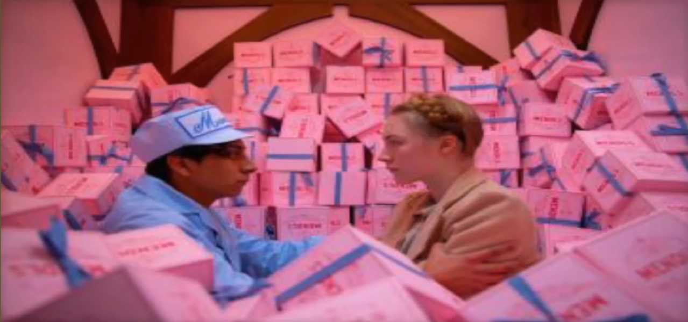
>>
>> - 什么样的景别,什么样的构图,角度,色彩,光线,形态 ......
>>
>>> 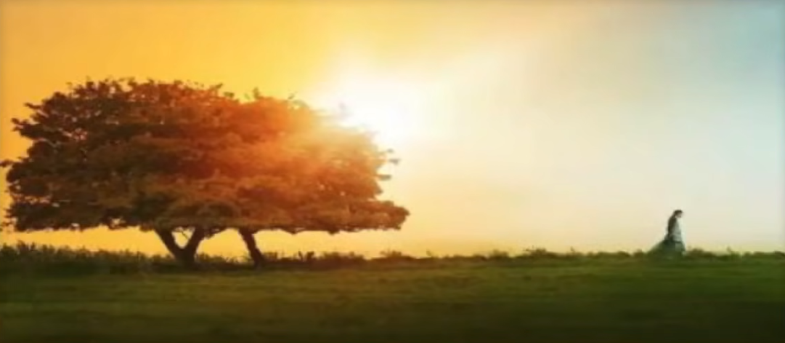  
>>>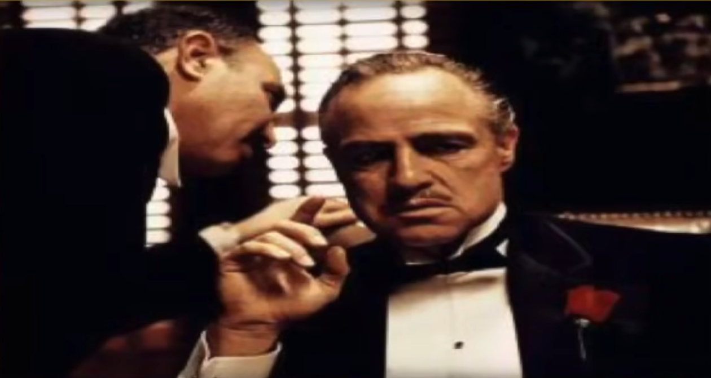  
>>>  
>>>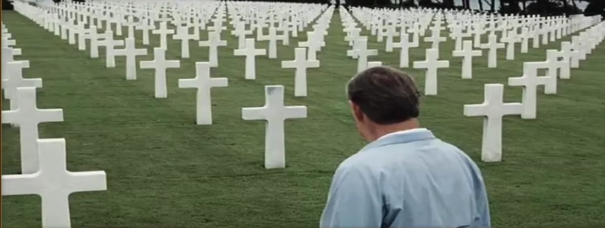
>>> 需要我们综合对整个画面的信息进行分析

#### 场面调度

> 通过场景的调度对巧妙的叙述人物关系变化
>> 拿王家卫的花样年华做一个对比，我们可以先看看一段影片，我们在这个影片中看到这是两人在吃饭的一个场景，非常简单，镜头的设计大家都能数出来到底有几个，为了知道各自配偶周太太和陈先生是怎么开始的，双方引起了对方的配偶。

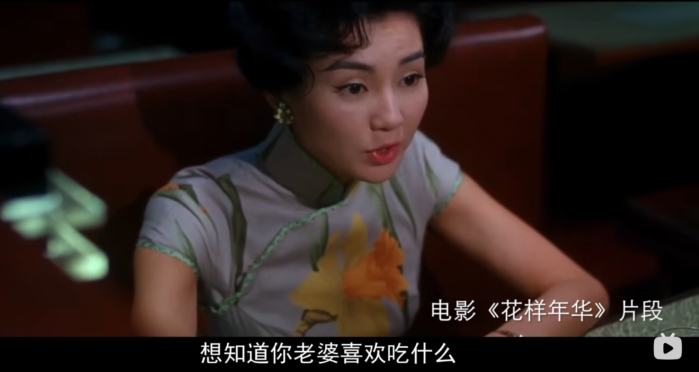  
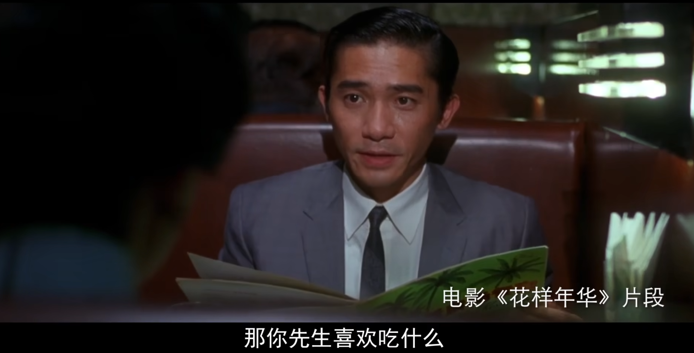  
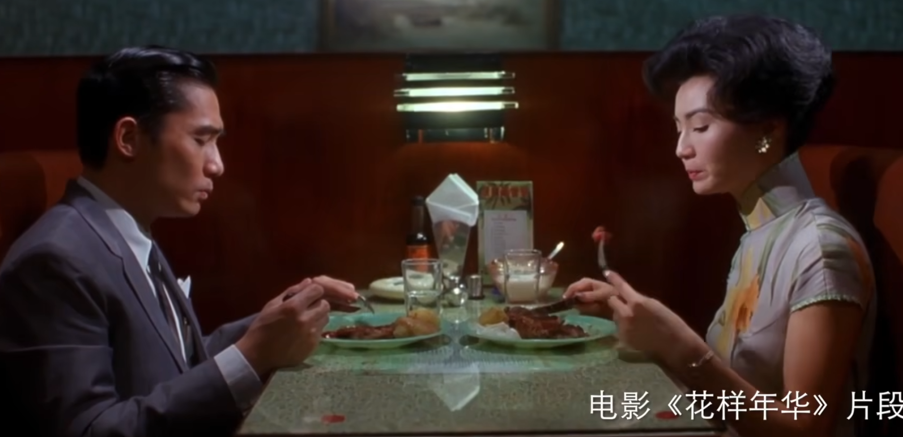  
  
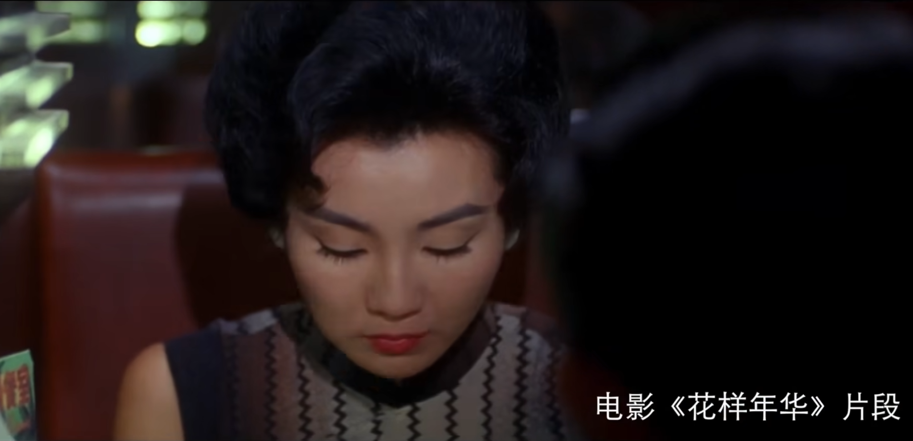  
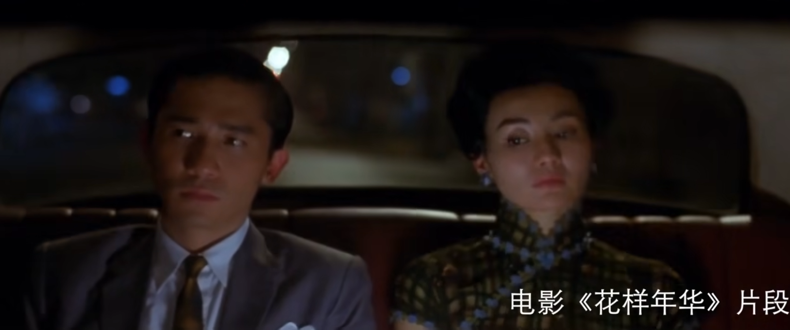

#### 场景对影片的影响

- 场景怎么去决定一个影片的风格

> 外景是怎么利于对于这个影片的一种气氛的营造，而内景是怎么对于这个影片一种光线的运用？
>>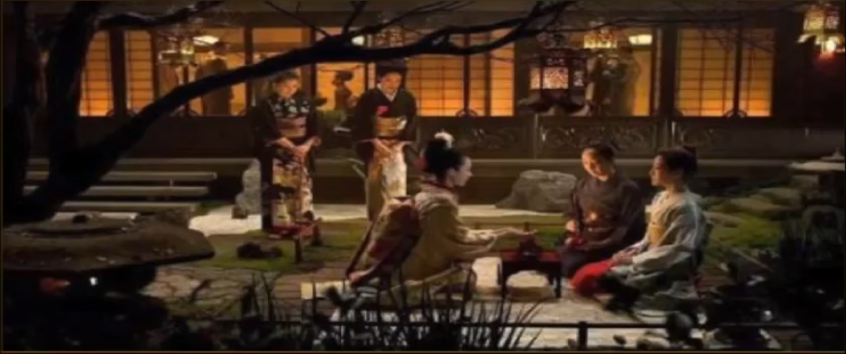  
>>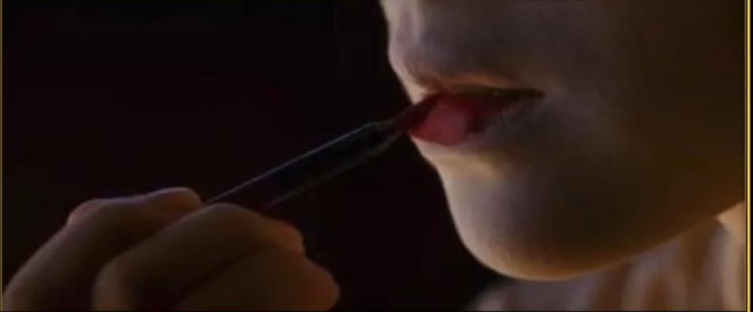

- 场景对人物的塑造

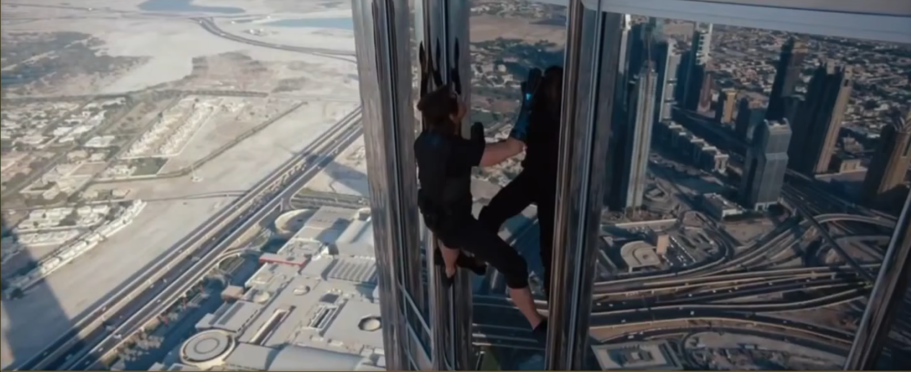  
  

- 影片整个**场信息**的一种基础的塑造

> 场信息我们经常会说是一个电影中最短的一个概念，其实我们一个个场景是构成这个场信息的一个个细胞，没有这些场景就没有这些场信息的完整性，它们之间是一环扣一环，层层累加的金字塔结构。
>
> 一场戏要在一个场景中完成，也可能在很多场景中进行完成，我们脑海中要有这根弦，在前期设计的时候我们就知道了，后期我们大概需要哪些场景，保证他们连在一起，没有技术问题。

- 决定了对于时空的一种呈现
  
> - 场景与时空的区别
>
>> 影片的时空是一个很大的概念，而影片的场景是一个很小的概念，这种大与小之间其实是有关联的。比如说电影中外景的出现，无论场次的多与少，长与短，都在影片中形成了一种**整体的空间规模**。我们感觉我们的效果到底是什么，其实都是由这些**场景的长短所决定**的。
>>
>> - 场景设计也是具体的，是**具象的**，是实际拍摄产生的，我们每一个设计都呈现在那地方，非常的具象。
>> - 时空其实你是看不见摸不着的，是**存在于我们脑海中**的，是由我们创作者建立的，跟我们的观众者之间**共同达成的一种啊空间效果。**
>>
>>> 所以时空是一个宽泛的心理的感触性的概念，他是由许多具体场景的综合起来的一个直觉的感受类似一种氛围感,让一个故事有了一个基调
>>>
>>> - 案例
>>>
>>> 
>>>> 采用一种解决问题但是全封闭的一种空间设计。核心是悬念但是带有窥视感。
>>>
>>> 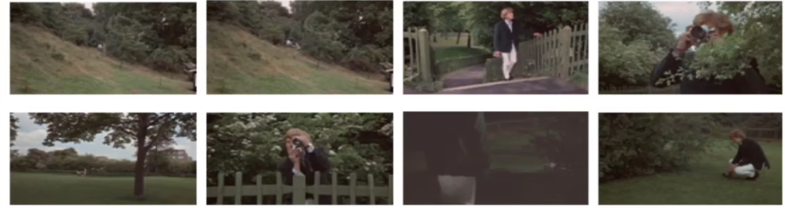
>>>> 一种开放的空间叙事，有一种探索性的现实主义题材。是关于真实的人与事存在的一种思考，是对于这个事件的一种想象。
>
> 通过这两个片子可以看到，**封闭和开放的空间形态**是各有优势的。前者紧张刺激。非常的激烈，引人入胜。后者真实含蓄，发人深省。虽然采用了不同场景的设计和定位，但是两种观念均能创作出比较优秀的摄影作品

### 空镜

空镜是整个视听语言中的喘息之处，类似说话时候的沉默，可能是在换气息也可能是在思考，也有可能是在等待。

#### 空镜分类

- 从视角分类

> - 主观空镜头
>
>> 跟随人物视角让人有一种身临其境的感觉  
>> 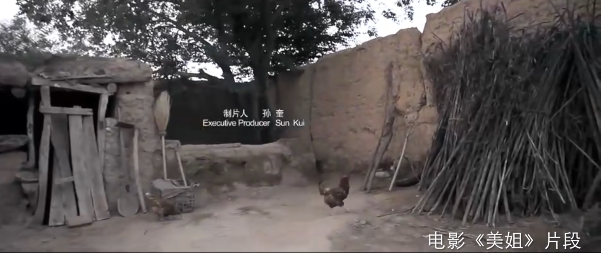
>>> 多用在恐怖片
>
> - 客观空镜头
>
>> 站在第三者的这种基础上，旁观人的基础上，角度上来去观察整个的环境景物，整个的影像的真实性
>> 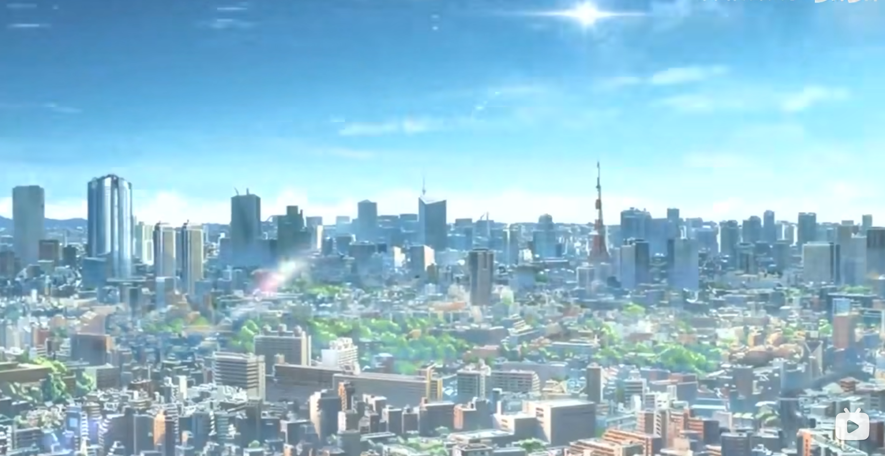

- 从内容分类

> - 风景空镜头（写景使用）
>
>> 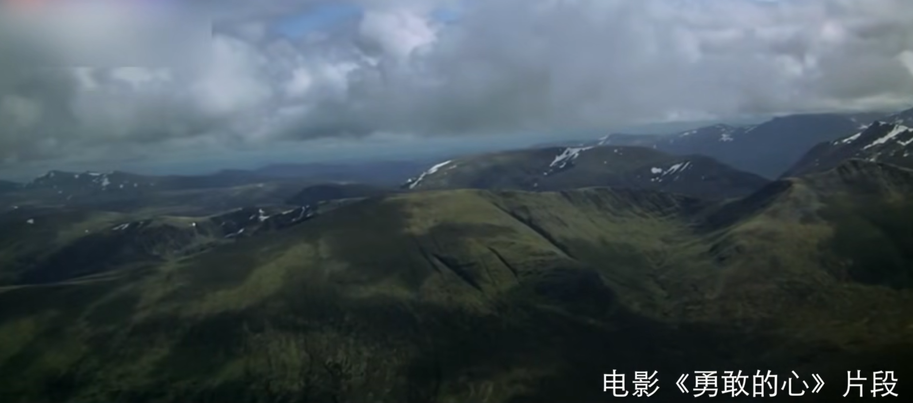
>> 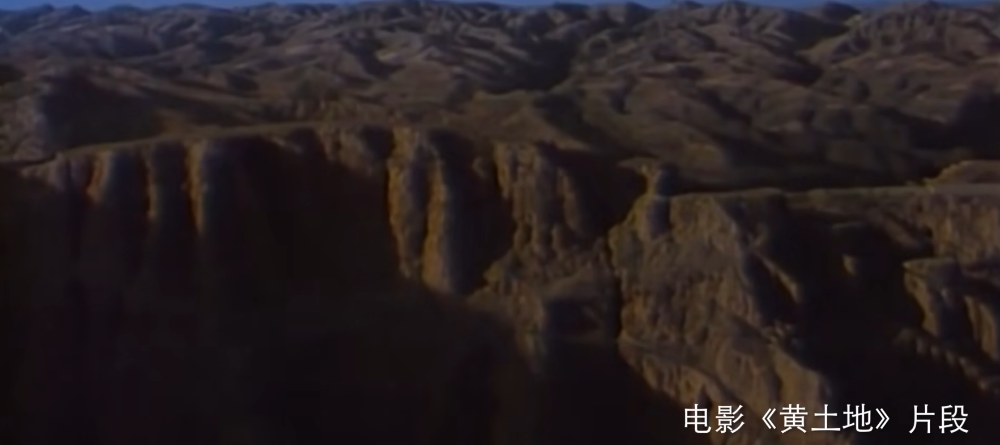
>
> - 细节空镜头（写物使用）
>
>>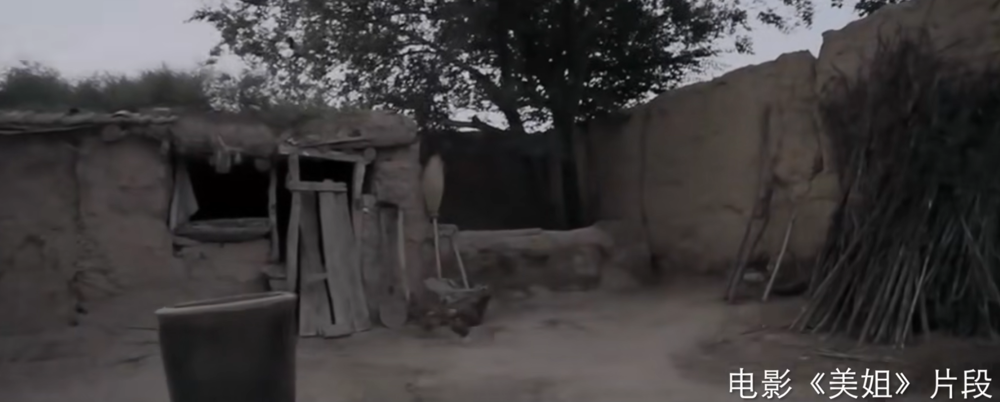
  
#### 空镜头的功能技巧

- 情景相融（寄情于景）
  
> 

- 留白（大音希声，大象无形）
  
> 留下空白控制节奏
> 留下思索和感悟的空间
>> 

- 交代环境背景
  
>   
>   
>   
>   
>   
> 
>> 将这个影片将要发生的时间、地点、环境在这八个空镜头中开始展现，给观众形成一种影调的效果。

- 压缩时空

> 
> 
>> 类似于时间飞逝，类似于岁月如织这样的词语，大体都可以用这样的方式来表现。

- 转场

> 对段落，对层次进行一种很明细的分开
>>   
>> 
>>
>>> - 空镜专场的抒情作用
>>> 弥补我们叙述性素材带来的一种表达情绪上的不足，为情绪的伸展提供一个很有效的空间
>
> - 景物中利用物体专场
>
>> 比如说在镜头前飞驰而过，火车、汽车(这往往是一种综合性的专场)
>>>   
>>>   
>>>   
>>>> 这个转场里头不仅仅有空镜的转场，作为物体本身的这种空镜转场，还有特技转场啊，显然它是由后期特技合成完成的。
>
> - 利用空旷场景专场
>
>> 主要用于节奏的控制详情在下

- 节奏控制

> 利用空镜来调节影片的节奏舒缓。稳定的空镜头能使我们的整个这一段落稳定下来，而短促、快节奏的剪切的这种空镜头能让我们的观众心理上产生一种莫名的紧迫感。
>>   
>>   
>>> 镜头由紧张到松弛，由晃动到相对稳定，由室内到室外，由暗到亮，这个节奏就有紧张的这种审讯，转而相对舒缓的空境外景。
>>
>>   
>>   
>>> 帮绑匪提款过程中的一个30多秒的空镜头组合
>>>
>>> - 交代时间的变化 凌晨到白天
>>> - 暂时舒缓了前面在室内武先生他们被绑架的这种紧张情绪。
>>> - 形成一种内外结合的一种处理变化
>>> - 略微晃动的镜头为接下来的叙事进行更合理的铺垫

- 渲染情绪

> 渲染我们整个情绪的一种过程。揭示人的心理，升华我们的情感。
>>   
>>   
>>> 通过反复的强调和渲染来表现了人物的一种矛盾的心理，我见不见我的妻子，我的妻子是不是还在等着我，旗杆上是不是挂着那个我们约定的那个黄手帕，其实这个过程就是用空境来渲染气氛，表现心境的这么一个过程。

- 烘托气氛

> 第五点有相似之处，空间是写景的，它都起到空烘托气氛的作用。
>>   
>>   
>>> 暗淡、低沉、紧张 这就是这一段的情绪的一种渲染
>>
>>   
>>> 烘托主人公渡边那种迷茫的心情和整体压抑的气氛。

- 营造意境

> 王国维先生在说的一切景语皆情语也的这种感觉，这就是意境。
>>   
>>   
>>   
>>   
>>   
>>> 这些画面与炮火连天的战场形成了强烈的视觉对比，有之前那些空镜的作用，同时也营造了一种诗情画意的浓郁的这种意境，没有你们的战争，没有你们的前方的努力，没有你在前方，我们怎么能得到安静，怎么能得到和平
>>
>>   
>>   
>>   
>>   
>>   
>>   
>>> 可以从这些画面中这五个季节的据东方美学的特点静美镜头的使用是充满诗意的，极具东方美学的特点，静美。
>>
>>   
>>   
>>   
>>> 整个禅意表现得十足，这就是意境，这就是导演想告诉我们的。

- 符号化的表达方式

> 使用空镜来作为符号化,代表具体内容的起幅变
>>   
>>   
>>   
>>   
>>> 羽毛这个符号的表现正如电影中阿甘见证了很多美国重大的历史时刻，人类的一些生活改变一样，穿行于这些关键期，这个空间可以说是整个影片的一个隐喻是一个符号化的一个体现人生  
>>> 一片羽毛一样，你不知道什么时间什么地点，被什么样的命运吹到何方，但是我们的人生，一生是平凡的，是知足的人同时又是不平凡的，但是我们最后一定要热爱生活，珍爱自己，这才是一个普世的价值观。

### 时间线

#### 影视中的时空的特点

- 时空密不可分

> 电影是一个相对独立的时空内发生的和发展的这么一个故事

- 时间由心而出发

> 电影的时间呢，它是一个单独存在的，我们在欣赏它、观赏它的时候，它就开始存在

- 时间的跳跃性

> 在镜头和镜头之间，时空是省略或跳跃，或者是延迟，或者是浓缩，我们可以快进，可以倒退，可以前后插入，可以压缩或可以拉长，这是影视的一种特点。

#### 感知影视中的时间形式

- 放映时间

> 一个作品在完成之后放映时所需要的整体时间。

- 叙述时间

> 影片中事件发生的时间都可以从一刹那到无限。
扔书包这个转场不仅是一个环境的转场，还是一个很大的时间的转场，时空的转场，在这种时间的维度中，我们要处理的很巧妙。

- 观赏时间

> 赏的心理时间就是放映时间和故事或事件发生时间综合起来，在我们受众的心理上产生这么一个独特的时间感。（例如当很投入的进入一个影片时时间在主观上感觉很快，当影片故事很出戏意识在戏里戏外跳跃时主观上感觉时间就很慢）

#### 时间的处理方式

- 等长时间

> 放映这一段时间和事件发生的时间一样的。
>> 纪录片北方的纳努克 
>>> 拉哈迪把那努克一家住宿的冰山上的山洞和海报放在一个长镜头内完成了拍摄，真实反映了人物、环境之间的关系，那努克一家的一种真实的一种记录。

- 省略的时间

> 放映时间要小于事件发生的时间  
**这个省略可以得到很好的诠释，比如说我们的影片怎么去跟时间博弈，剪切镜头**
>> 泰坦尼克号  

>>> 好像是在声音中醒来，好像是在回忆中醒来，好像是在过去到现在的过程中发生了一瞬间的改变，这就是我们常说的省略时间。

- 扩展时间

> 放映时间大于事件发生的时间——**升格镜头**
> 放大时间，通过对一个细节的强化对时间的拉长，甚至是固定静止，来帮助我们延长对于时间的一种感化，帮助我们了解时间的魅力，帮助了解这个镜头它的**重要性有多大。**
>> ☞[骇客帝国] 用了一分钟来表现子弹射击的镜头
>>
>> 英雄本色
>> 
>>   
>>   
>>> 紧接后面正常记录镜头，跟他进行一种配合，体现出一种节奏的张力，让人感受到了在被击者倒地瞬间那种痛快的感觉。

[骇客帝国]:https://www.bilibili.com/video/BV1Gt4y1k71Z/?spm_id_from=333.337.search-card.all.click&vd_source=9ae5fb05c771775a6b5923ba1c682cf7

- 时间回到原点

> 重新将这一幕扮演然后我们跟主人公一起，又一次经历了我们思维中、脑海中的这个情境。
>> 死神来了  

>>> 实在强化感受这种死亡段落，让你感受到这种预感

- 时间重构

> 重构总在省略后，略是为了控制节奏，为了营造想象而后重构是为了增加戏剧性，重新控制把控时间的脉络
>> 偷天陷阱  

  

>>> 直到实际盗宝这个过程展现出来才完全明白，原来当初的训练是为了最后这样这样这样来进行道保。

- 引导回忆

> 其实就从现在的时态到过去的时空
>> 美国往事  
  

>> 利用各种专场方式引导回忆

- 脉络关联

> 有些段落，他们需要相互之间进行搭配，才能了解到这个时间脉络，才能了解到它的这种价值。
>> 天使Emily  

>>> 艾米ily躺在床上看电视，屏幕上演着举国悼念艾米丽的这种故事，当然采用了黑白的方式跟彩色形成对比，我们观众在看到这一段的时候啊，只是觉得善于做白日务的艾米丽又一次唤醒而已。  所以成长于影像时代的我们，或者说年轻观众，对于时空的跳跃，这种感觉跟我们的父辈不太一样，他们得到的影像观跟我们得到影像观，我们一代一代人之间其实都是不一样的，所以类似于这种时空重构，时间的这种重构的这种方式，已经远远超过了以前的这种受众。

- 时间闪现

> 细节来展示时间的一种闪现
> 去刺激观众去接受即将到来的一种变化。
>> 罗拉快跑  
  
  
  
  
  
  
  
  
  
  
  
  
  
  
>>> 当他跑的过程中，每出现一个新的人物，就会伴随这个人物的过程。以前。将来各种生活的这种片段的展现，这种过程的展现，其实就是用细节来进行表现时间。用细节来引出闪现，刺激回忆和想象的一种空间，也刺激观众得到一种概念。

- 时间和空间交织

> 一种绵延的时间概念在里头穿越这种时间的维度和空间的维度，以一种时间比和空间比的方式发生一种勾连。  
> （**时间和空间互相作为对方突破的支点进行时空的穿越，同时在各个跳跃时空中交织出一个完整的叙述线**）
>> 盗梦空间  
  
  
  
>>> 做梦在这里头依次向上分为现实世界第一层梦境、第二层梦境，第三层梦境，第四层梦境和迷失域。它分了六个层次在里面，那单独的时间维度其实并不是特别强大，但是一旦它跟空间搭上交织在了一起，就成了我们的烧脑神片。

### 布光

本章作为影视用光的大致介绍，重点体会布光在影视中的一些作用特点，详情的布光技巧以及光影理论见☞[光影色彩理论](%E5%85%89%E5%BD%B1%E8%89%B2%E5%BD%A9%E7%90%86%E8%AE%BA.md)
笔记

#### 光线与时空

> 光线其实为时空来进行服务的各种元素的复合组织和构成，呈现出了电影的一种时空运动，让观众感受到了我们对于光线、对于时间、对于空间的流逝感、导流、断裂、重新聚合以及表达出电影时空的特征。

- 根据时空来设计色温，区分不同的空间

> 电影闪灵
>   
>   
>   
>   
>   
>> 摄影师有意地将三个空间处在了一个段落中，形成了三种不同的色调，以此去区分三种不同的环境，这就是通过我们的布光，通过我们的光线来进行不同空间的营造。

- 根据时空去设计光效，丰富我们的一种情感上的表达

> 沉默的羔羊
>>   
>>   
>>   
>>   
  
>>   
>>   
  

- 根据时空设计亮暗的一种间隔，辅助叙事的进程

> 沉默的羔羊
>>   枪战之前，刚进门的时候，光线比较正常  
>>   
>>   
  
  

- 根据时空去设计情绪来串联空间的区域

> 蓝白红这个经典的三部曲
>>   这一个大段落分了几个空间，这几个空间我们可以通过光线进行合理的串联。 
>>>   门外色光照明反差加大，然后背景上有红色的色块，映衬了整个电影的一种基调和人物的性格。
>>>   然后呈现一种剪影的效果，这又是一种光线。
>>>   透过窗户的光线照亮人物，明亮的光线，大反差的影像，刻画出了环境的一个微弱的这种光线的特征。
>>>   走到手术室门口，明亮的光线又衬托着他一种黑色的剪影。由亮开始变暗。靠在门旁，露出了我们的医生。这地方用了主光、副光、修饰光等等，形成了光线这种变化。
>>>   然后反打朱莉的这种境界。整体反差继续加大，环境特点非常明确，又有了一种造型和表意上的一种差别，把这个人物的一种善良，把这个人物的一种特性表现的无疑。

- 根据时空设计段落去结构整个时空的顺序

> 末代皇帝  
> 一种倒叙式的、套层式的时空表达方式。在这种倒叙和套层的表达方式中，光线发挥了很重要的这种作用，一个是它的现在时，一个是它的回忆或者说是过去时。两个时空在光线上的设计是截然不同的
>>   
  现实时空。是以自然光效为主，但是光比非常大，冷调多，日景多，光线运动少。整个影调的反差比较大。
>>   
  
  回忆时空，我们采用的更多是戏剧光效，室内多暖调多光比稍微比较小，光线的变化相反是非常大的。然后整个影调是一种暗沉的一种饮料，既有融合又有对比。
>>> 两种时空虽然对比比较明显，但是之间又相辅相成，同构成了这部影片的一种基调，同构成了现实与回忆的一种结合，成了的一种真实的生活序列。

#### 取景中设计画面光影

> 在拍摄布光时，首先要完成和场景的一种结合（内景、外景、自然景、人工景等等等等这些这些场景都有各自的特点。）
>> 选择场景、营造氛围时，要结合历史资料进行合理的艺术加工
>>> 长城  
  
>>>>以看到它的一些啊场景图，都是基于对长城的艺术化、电影化的重设。
>>
>> 取景时候，我们还要考虑大致机位、镜头的使用确定等等。  画面的构成、构图和视觉效果都可以得到一种保障，然后根据场景进行光线的设计和场面的调度。摄影师需要时刻有缜密的思考和对于现场准确的这种判断
>>> 被解救的姜戈
>>>> 射机在13米的摇臂上进行运动，通过梯子扶梯进行拍摄
>>>>   开始的焦点是在劳拉里的裙子的边上
>>>>   摄影机跟随这个楼梯上仰拍，两个女人以视线水平的位置跟随他们来到了二楼的这种小平台。

- 首先从定光开始

> 定光就是电影摄影中实时曝光控制的一种手段。我们先确定某场戏的一种标准，中间灰亮度，把它记作一种正确曝光值，其他画面中的其他的亮度都可以进行合理的摆布。
>>   如这张柯达胶片的定光示意图，我们可以看到上面的不同点的一种曝光指数。
>>定光的时候，我们要注意几个点啊，其中最重要的就是我们的门窗等高亮度透射物体，注意这些光亮的关系。让曝光在宽度之内，可以利用窗纱，可以利用凡士林，可以利用烟雾，可以利用贴柔光纸等方式在窗户或门窗上做一些设计，我们要想让它暗，但是也不要暗的死黑一片，我们可以对于窗外的环境，门外的环境进行这种光线的简单补光啊，变色的这种效果。
>>> 老炮  
  
  
  
  
  
  
  
  
>>> 几个门窗的这种段落，我们可以进行一种大概的思考。画面上对不同区域曝光的控制

- 控制光比
  
> 末代皇帝，
>> 从登基后由日本回国的溥仪回到了伪满洲国。
>>>   
  零散的大光比夕阳光线就像照妖镜一样，照出了这个傀儡宫殿傀儡机构里的一种险恶但大反差的。
>>
>> 末代皇帝 溥仪他刚被押返回国在车站的这个场景
>>>   
  画面低沉厚重，场景和人物采用了反差比较大的画面效果进行曝光
>>>   由这种光线氛围进而上升到了影像感、仪式感，观众能够捕捉到溥仪此时的心情，灰冷、紧张、害怕和无助。

- 影调的选择

> 末代皇帝
>> 他被押返回国。在车站。
>>   刚开始天空亮度非常高  
  火车进站带来的烟雾很好地借用了高亮度的空间，营造出了一个非常舒服的影调效果和氛围，有了画面中的立体的营造感  
>>   车站内部同样也使用了烟雾这一个很有效的工具，在逆光的作用下和侧逆光的作用下开始铺垫营造暗环境中的饮料氛围  
>>   溥仪走进了屋子，隐藏在黑暗的区域，与高亮度的轮廓形成了鲜明的对比，寓意不言而喻。

- 氛围的衔接
  
> 一方面利用了画面内容进行衔接，另一方面利用了镜头的运动进行衔接。在保障整体影像氛围统一的情况下，我们可以便于导演的一种合理叙事。
>> 末代皇帝
>> 他被押返回国。在车站。
>>>   
  
刚开始画面的天空亮度比较大，火车进站带来的烟雾营造这种效果，我们说了有了立体感
>>>   镜头慢慢地向前推进，烟雾逐渐散去，暗层次的车占了画面的大部分比例和面积，自然压暗了整个的画面的影调空间。
>>>   镜头继续往前推进，由人接着由车引出了我们的战犯出现的画面。
>>>   
  战犯出现的画面都是以散射光居多，整体画面冷调。
> 大场景渲染的是气氛，整体的调性，而到了近景或特写画面的时候，人物的光笔要比全景和远景要更大，其他电影的拍摄其实都是如此。  
> 大小景别在拍摄布光时候都是有所区别对待的
>> 末代皇帝，溥仪在打网球时
>>>   溥仪先是在阳光明媚的去打网球。画面温暖，光线舒适，叙事平稳。  
>>>   
  接着士兵突然蜂拥而入，影像在士兵进入的同时，光圈自然地进行收缩，光线开始阴冷下来，阴天的效果明显。  
>>>   背后是多云的黄昏，半剪影的画面意味深长。

**光线不是以自然的意志为转移，而是以创作者的意志为转移。**  
  
  

### <a id="节奏"> 节奏把控 </a>
